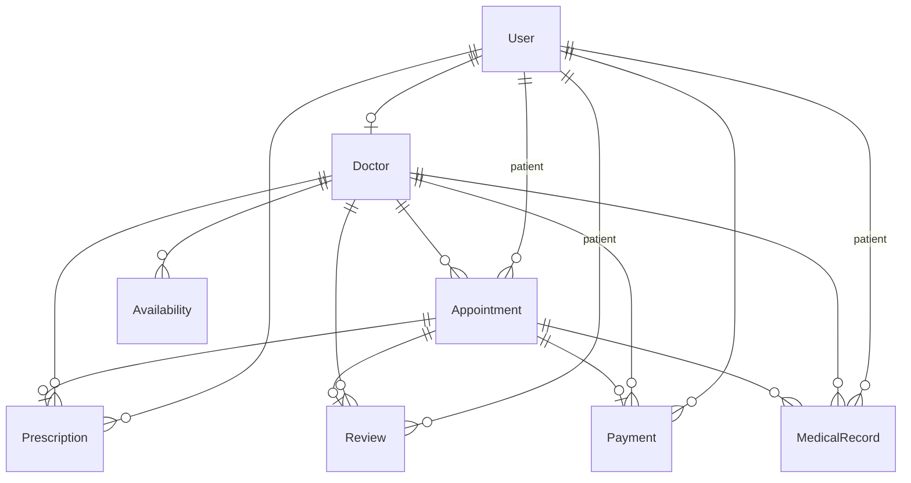

# Pulse — Clinic Appointment System

> **A full-stack, production-ready clinic management platform.**  
> Patients discover doctors, book appointments, and manage health records.  
> Doctors control schedules, write prescriptions, and review patient history.  
> Admins oversee operations, generate reports, and manage the entire ecosystem.
<p align="center">
  <strong>🚀 Live Demo:</strong>
  <a href="https://pulse-clinicapp.vercel.app">https://pulse-clinicapp.vercel.app</a>
</p>

<p align="center">

https://github.com/user-attachments/assets/63042481-d05a-49b0-8684-964bf5c12946

</p>
---

## Table of Contents

- [Quick Start](#quick-start)
- [Seed Accounts](#seed-accounts)
- [Tech Stack](#tech-stack)
- [Architecture](#architecture)
- [Route Map](#route-map)
- [API Endpoints](#api-endpoints)
- [Database Schema](#database-schema)
- [Features](#features)
- [Commands](#commands)
- [Environment Variables](#environment-variables)
- [Deployment](#deployment)
- [Design System](#design-system)
- [Gotchas](#gotchas)

---

## Quick Start

```bash
# 1. Navigate to project root
cd clinic-app

# 2. Install dependencies
npm install

# 3. Copy environment file and configure
cp .env.example .env
# Required: NEXTAUTH_SECRET (generate with: openssl rand -base64 32)
# For Turso: set DATABASE_URL + TURSO_AUTH_TOKEN

# 4. Generate Prisma client & seed database
npx prisma generate
npx tsx prisma/seed.ts

# 5. Start development server
npm run dev        # → http://localhost:3000
```

---

## Seed Accounts

> **⚠️ Production notice:** All accounts default to password `admin123`.  
> Change these immediately in production via the database or profile page.

| Role | Email | Password | Notes |
|------|-------|----------|-------|
| **Admin** | `admin@clinic.com` | `admin123` | Full system access |
| **Patient** | `patient@clinic.com` | `admin123` | Pre-registered, registration fee paid |
| **Doctor** | `abdulbari@clinic.com` | `admin123` | Dr. Abdul Bari Khan — Cardiologist |
| **Doctor** | `adeebrizvi@clinic.com` | `admin123` | Dr. Adeebul Hasan Rizvi — Urologist |
| **Doctor** | `asmahumayun@clinic.com` | `admin123` | Dr. Asma Humayun — Dermatologist |
| **Doctor** | `nadeemsheikh@clinic.com` | `admin123` | Dr. Nadeem Ahmed Sheikh — Neurologist |
| **Doctor** | `muhammadirfan@clinic.com` | `admin123` | Dr. Muhammad Irfan — Orthopedic Surgeon |
| **Doctor** | `faisalsultan@clinic.com` | `admin123` | Dr. Faisal Sultan — Internal Medicine |
| **Doctor** | `javedakram@clinic.com` | `admin123` | Dr. Javed Akram — Endocrinologist |
| **Doctor** | `rizwanachaudhri@clinic.com` | `admin123` | Dr. Rizwana Chaudhri — Gynecologist |
| **Doctor** | `shabnamrizvi@clinic.com` | `admin123` | Dr. Shabnam Rizvi — Ophthalmologist |
| **Doctor** | `muhammadalijan@clinic.com` | `admin123` | Dr. Muhammad Ali Jan — Pediatrician |
| **Doctor** | `aamirzaman@clinic.com` | `admin123` | Dr. Aamir Zaman — Psychiatrist |
| **Doctor** | `farahnaaz@clinic.com` | `admin123` | Dr. Farah Naaz — ENT Specialist |

---

## Tech Stack

| Layer | Technology |
|-------|-----------|
| **Framework** | Next.js 16.2 (App Router, Turbopack) |
| **Database** | Turso (cloud-hosted LibSQL) / SQLite (local dev) |
| **ORM** | Prisma 7 (`@prisma/adapter-libsql`) |
| **Auth** | NextAuth.js v4 (JWT, credentials provider) |
| **Styling** | Tailwind CSS v4 + dark-theme inline styles |
| **Charts** | Recharts (admin revenue/performance reports) |
| **Icons** | Lucide React |
| **Email** | Nodemailer via Gmail SMTP |
| **Hosting** | Vercel (serverless functions) |
| **Language** | TypeScript (strict mode) |

---

## Architecture

```
clinic-app/
├── app/                          # Next.js App Router
│   ├── page.tsx                  # Landing page with hero, specialties, CTA
│   ├── layout.tsx                # Root layout (grid-bg, Navbar, Footer, Providers)
│   ├── globals.css               # Dark theme variables, animations, grid background
│   ├── providers.tsx             # SessionProvider wrapper
│   ├── login/                    # Sign-in page
│   ├── register/                 # Patient registration
│   ├── forgot-password/          # Password reset request
│   ├── reset-password/           # Password reset with token
│   ├── payment/                  # Registration fee payment
│   ├── contact/                  # Contact form
│   ├── doctors/                  # Public doctor listing & detail pages
│   ├── dashboard/                # Patient-protected routes
│   ├── doctor/                   # Doctor-protected routes
│   ├── admin/                    # Admin-protected routes
│   └── api/                      # RESTful API endpoints
├── components/                   # Reusable UI components
│   ├── Navbar.tsx                # Role-aware adaptive navigation
│   ├── Footer.tsx                # Global footer with links
│   ├── DoctorCard.tsx            # Doctor listing card (avatar, fee, rating)
│   ├── AppointmentCard.tsx       # Appointment summary card
│   └── ui/                       # Primitive UI components
│       ├── StatusBadge.tsx       # Color-coded status pills
│       └── PaymentBadge.tsx      # Payment status indicator
├── lib/
│   ├── prisma.ts                 # Prisma singleton with LibSQL adapter
│   ├── auth.ts                   # NextAuth config (JWT, credentials)
│   ├── email.ts                  # Nodemailer email service (7 templates)
│   └── time.ts                   # Time formatting utilities
├── types/
│   └── index.ts                  # Shared TypeScript interfaces
└── prisma/
    ├── schema.prisma             # Database schema (8 models)
    ├── seed.ts                   # Idempotent seed (13 doctors, admin, patient)
    ├── prisma.config.ts          # Prisma 7 datasource configuration
    └── dev.db                    # Local SQLite database (gitignored)
```

---

## Route Map

### Public Routes

| Path | Description |
|------|-------------|
| `/` | Landing page — hero, specialties, features, testimonials, CTA |
| `/login` | Sign in with email & password |
| `/register` | Create a new patient account |
| `/forgot-password` | Request password reset link |
| `/reset-password?token=...` | Set new password using email token |
| `/contact` | Contact form + developer info |
| `/doctors` | Browse all doctors — search by name, filter by specialization, sort by fee/experience/rating |
| `/doctors/[id]` | Doctor detail — bio, qualifications, reviews, weekly availability |

### Patient Routes (`/dashboard/*`)

| Path | Description |
|------|-------------|
| `/dashboard` | Dashboard — stats, next appointment, recent prescriptions |
| `/dashboard/appointments` | View/manage appointments — filter tabs, cancel, rate completed |
| `/dashboard/book/[doctor-id]` | Book appointment — date picker, slot selection, reason |
| `/dashboard/prescriptions` | View prescription history |
| `/dashboard/payments` | View payment history |
| `/dashboard/profile` | Edit personal profile & phone number |
| `/dashboard/records` | View medical records |
| `/payment?userId=X` | Pay registration fee (Rs. 500) — required before booking |

### Doctor Routes (`/doctor/*`)

| Path | Description |
|------|-------------|
| `/doctor/dashboard` | Dashboard — average rating, feedback, today's appointments |
| `/doctor/appointments` | View/manage appointments — confirm, complete, cancel |
| `/doctor/availability` | Set weekly availability schedule |
| `/doctor/prescriptions` | Write & manage prescriptions |
| `/doctor/profile` | Edit profile (specialization, qualification, experience, fee, bio, avatar) |
| `/doctor/medical-records` | View patient medical records |

### Admin Routes (`/admin/*`)

| Path | Description |
|------|-------------|
| `/admin/dashboard` | Dashboard — total counts, appointment breakdown, revenue |
| `/admin/appointments` | View all appointments — filters (All/Today/Month + status) |
| `/admin/doctors` | Manage doctors — list, add, activate/deactivate, edit |
| `/admin/doctors/[id]/edit` | Edit doctor details (specialization, fee, bio, etc.) |
| `/admin/doctors/add` | Add new doctor |
| `/admin/patients` | Manage patients — list, detailed view |
| `/admin/reports` | Reports — revenue chart, doctor performance, patient history — CSV export |

---

## API Endpoints

> All endpoints require authentication (via NextAuth session) unless marked **public**.

### Auth

| Endpoint | Methods | Auth | Purpose |
|----------|---------|------|---------|
| `/api/auth/register` | POST | Public | Register new patient + create registration payment |
| `/api/auth/login` | POST | Public | Authenticate and return session |
| `/api/auth/me` | GET, PUT | Required | Get/update current user profile |
| `/api/auth/forgot-password` | POST | Public | Send password reset email |
| `/api/auth/reset-password` | POST | Public | Reset password with token |
| `/api/auth/[...nextauth]` | GET, POST | Public | NextAuth.js handler |

### Doctors

| Endpoint | Methods | Auth | Purpose |
|----------|---------|------|---------|
| `/api/doctors` | GET | Public | List doctors + specializations (search, filter, sort) |
| `/api/doctors/[id]` | GET, PUT | Public GET, Admin/Doctor PUT | Doctor detail, update profile |
| `/api/doctors/me` | GET | Doctor | Current doctor's own profile |

### Appointments

| Endpoint | Methods | Auth | Purpose |
|----------|---------|------|---------|
| `/api/appointments` | GET, POST | Required | List (role-filtered), create new |
| `/api/appointments/[id]` | GET, PUT, PATCH | Required | Get/update/manage single appointment |

### Availability

| Endpoint | Methods | Auth | Purpose |
|----------|---------|------|---------|
| `/api/availability` | POST | Doctor | Create availability slots |
| `/api/availability/[doctor-id]` | GET, PUT | Public GET, Doctor PUT | Get/update weekly schedule |
| `/api/availability/[doctor-id]/[date]` | GET | Public | Available time slots for specific date |

### Payments

| Endpoint | Methods | Auth | Purpose |
|----------|---------|------|---------|
| `/api/payments` | GET, POST | Required | List payments, create payment |
| `/api/payments/[id]` | GET | Required | Single payment details |
| `/api/payments/register` | GET, PUT | Required | Check/simulate registration fee payment |

### Medical Records

| Endpoint | Methods | Auth | Purpose |
|----------|---------|------|---------|
| `/api/medical-records` | GET, POST | Required | List (role-filtered), create |
| `/api/medical-records/[id]` | GET, PUT | Required | Get/update single record |

### Prescriptions

| Endpoint | Methods | Auth | Purpose |
|----------|---------|------|---------|
| `/api/prescriptions` | GET, POST | Required | List (role-filtered), create |
| `/api/prescriptions/[id]` | GET, PUT | Required | Get/update single prescription |

### Reviews

| Endpoint | Methods | Auth | Purpose |
|----------|---------|------|---------|
| `/api/reviews` | GET, POST | Public GET, Patient POST | List reviews (`?doctor_id=`), create (`?appointment_id=`) |

### Admin

| Endpoint | Methods | Auth | Purpose |
|----------|---------|------|---------|
| `/api/admin/stats` | GET | Admin | Dashboard counts & metrics |
| `/api/admin/reports` | GET | Admin | Monthly/doctor/patient reports |
| `/api/admin/patients` | GET | Admin | List all patients with details |

### Other

| Endpoint | Methods | Auth | Purpose |
|----------|---------|------|---------|
| `/api/contact` | POST | Public | Submit contact form (sends email to admin) |
| `/api/user/me` | GET | Required | Current user with payment status |

---

## Database Schema (8 Models)



### Key Models

- **User** — `id`, `name`, `email`, `password`, `role` (patient|doctor|admin), `phone`, `paid`, `reset_token`, `reset_token_expires`, `created_at`
- **Doctor** — `id`, `user_id`, `specialization`, `qualification`, `experience`, `fee`, `bio`, `avatar` (base64), `is_active`
- **Appointment** — `id`, `patient_id`, `doctor_id`, `appointment_date`, `appointment_time`, `status` (pending|confirmed|completed|cancelled), `reason`
- **Payment** — `id`, `appointment_id?`, `patient_id`, `doctor_id?`, `amount`, `type` (registration|appointment), `status`, `paid_at`
- **Prescription** — `id`, `appointment_id`, `doctor_id`, `patient_id`, `medicines`, `instructions`
- **Review** — `id`, `patient_id`, `doctor_id`, `appointment_id`, `rating` (1-5), `comment`
- **MedicalRecord** — `id`, `patient_id`, `doctor_id`, `appointment_id?`, `record_type`, `title`, `file_data` (base64)
- **Availability** — `id`, `doctor_id`, `day_of_week`, `start_time`, `end_time`, `slot_duration`

---

## Features

### 🔐 Authentication & Security
- JWT-based authentication with NextAuth.js
- Role-based access control (patient / doctor / admin)
- Registration fee (Rs. 500) gate for new patients
- Forgot / reset password flow with email token
- Password change email notification

### 👨‍⚕️ Doctor Management
- Search by name, filter by specialization (dynamic dropdown)
- Sort by name, fee, experience, or rating
- Detailed profiles with avatar upload (base64)
- Professional fields: specialization, qualification, experience, fee, bio
- Weekly availability scheduling with configurable slot durations

### 📅 Appointment System
- Real-time slot availability based on doctor's schedule
- 30-minute default slot duration
- Status workflow: pending → confirmed → completed / cancelled
- Patient dashboard with filter tabs (All / Upcoming / Completed / Cancelled)
- Role-appropriate views for patients, doctors, and admins

### 💳 Payments
- Registration fee (Rs. 500) — one-time payment for new patients
- Simulated payment flow (ideal for demo/testing)
- Payment history and status tracking

### 📧 Email Notifications (Nodemailer)
- Welcome email on registration
- Booking confirmation (sent to both patient and doctor)
- Appointment status change notifications
- Password reset link
- Registration fee receipt
- Password change confirmation
- Contact form submissions to admin

### 📊 Admin Dashboard
- Revenue charts (monthly breakdown, 12-month history)
- Doctor performance metrics (completions, revenue)
- Patient history overview
- CSV export for all report sections
- Full CRUD for doctors (add, edit, activate/deactivate)
- Appointment oversight with powerful filtering

### 📋 Medical Records & Prescriptions
- Digital prescriptions linked to appointments
- Medical records with base64 file attachment
- Role-filtered access (patients see their own, doctors see their patients')

### 🎨 UI/UX
- Dark theme (`#0a0a0f` background, `#6366f1` accent)
- Responsive design — works on mobile, tablet, desktop
- Subtle grid overlay consistent across all pages
- Lucide React icons throughout (no emojis)
- Interactive hover states (JS event handlers, no CSS pseudo-classes)

---

## Commands

```bash
npm run dev             # Development server on port 3000
npm run build           # TypeScript check + Turbopack production build
npm run start           # Start production server
npm run lint            # ESLint
npx prisma generate     # Regenerate Prisma client after schema change
npx prisma db push      # Sync schema to SQLite (no migration)
npx tsx prisma/seed.ts  # Seed database (idempotent — safe to re-run)
npx playwright test     # Run all E2E tests (47 tests across 11 spec files)
```

---

## Environment Variables

```env
# Database (Turso for production, SQLite for local)
DATABASE_URL=libsql://your-database.turso.io
TURSO_AUTH_TOKEN=your-turso-auth-token

# NextAuth
NEXTAUTH_SECRET=your-random-secret-base64
NEXTAUTH_URL=https://your-domain.vercel.app

# Email (Gmail SMTP)
EMAIL_HOST=smtp.gmail.com
EMAIL_PORT=587
EMAIL_USER=your-email@gmail.com
EMAIL_PASS=your-app-password
```

---

## Deployment

### Vercel + Turso (Production)

This project is deployed on **Vercel** with **Turso** (cloud-hosted LibSQL) as the production database.

1. Push code to GitHub
2. Import repository in Vercel
3. Set **Root Directory** to `clinic-app/`
4. Configure environment variables (see above)
5. Build command: `prisma generate && next build` (set in `package.json`)
6. Deploy — Vercel auto-deploys on every push to `main`

> **Note:** Ensure Deployment Protection is disabled (or set to "Only Preview Deployments") for public access.

### Local SQLite

For local development, SQLite is used via `file:./dev.db`. No external database setup required.

---

## Design System

### Theme Colors

| Token | Value | Usage |
|-------|-------|-------|
| `--bg-primary` | `#0a0a0f` | Page background |
| `--bg-card` | `rgba(22, 22, 31, 0.7)` | Card backgrounds |
| `--border-card` | `rgba(42, 42, 58, 0.6)` | Card borders |
| `--accent` | `#6366f1` | Primary accent (indigo) |
| `--text-primary` | `#f0f0ff` | Primary text |
| `--text-secondary` | `#8888aa` | Secondary text |
| `--text-muted` | `#555570` | Muted text |

### Conventions

- **`backgroundColor`** over `background` in inline styles (shorthand resets grid background-image)
- **Lucide React** icons only — never emojis
- **Labels** for form inputs, never placeholder text
- **Card radius**: `14-16px`, padding: `20-24px`
- **Section padding**: `100px 24px`
- **`.grid-bg`** class on `<body>` for subtle grid overlay

---

## Gotchas

1. **`useSearchParams()` requires `<Suspense>`** — wrap components using it in a `Suspense` boundary (Next.js 16 requirement).

2. **`background` vs `backgroundColor`** — Inline `background` shorthand resets `background-image` from `.grid-bg`. Always use `backgroundColor`.

3. **SQLite limitations** — No enums, arrays, or JSON columns. Statuses are plain strings. File data stored as base64.

4. **Prisma 7 config** — Database URL is set in `prisma.config.ts`, not in `schema.prisma`. CLI tools (`db push`, `generate`) read from the config file.

5. **Dev.db is gitignored** — Fresh clones must run `npx tsx prisma/seed.ts` to create the local database.

6. **No middleware.ts** — Route protection is handled server-side in layout components using `getServerSession`.

7. **Patient password updated** — The patient account password was changed from `admin123` to `admin231` post-seed. The seed always resets to `admin123`.

8. **Turso auth** — Running `prisma/seed.ts` against Turso requires `TURSO_AUTH_TOKEN` environment variable. Without it, the connection fails with column-not-found errors.

---

## License

MIT — built as a portfolio project.

---

<p align="center">
  <strong>Built with</strong> Next.js · Prisma · Turso · Tailwind CSS · Vercel
</p>
<p align="center">
  <a href="https://pulse-clinicapp.vercel.app">🌐 Live Demo</a>
</p>
